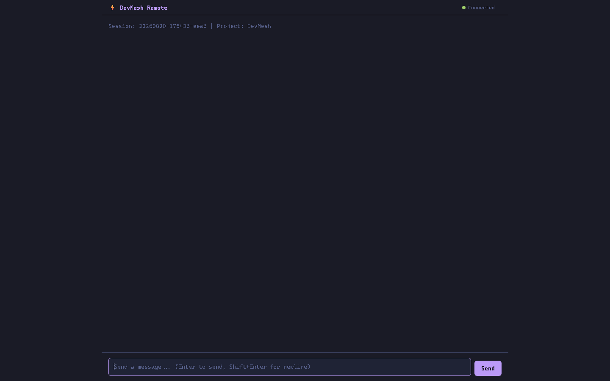
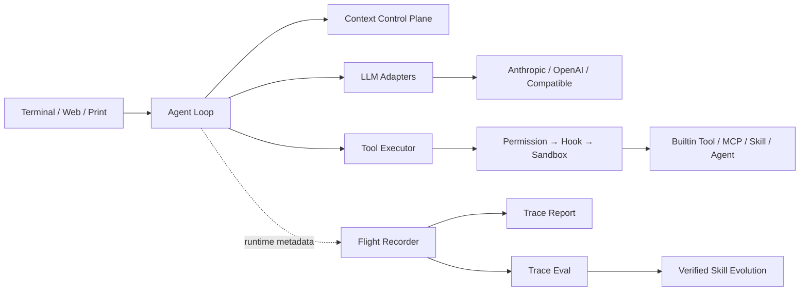
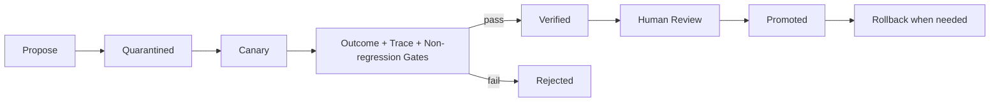

# DevMesh

> 面向复杂软件研发任务的可观测、可安全进化智能编程平台

[](https://github.com/tdO-0/DevMesh/actions/workflows/ci.yml)

[](https://github.com/tdO-0/DevMesh/releases)


DevMesh 使用 Java 21 构建本地 Coding Agent 执行引擎，将多模型接入、ReAct 循环、上下文治理、Tool/MCP、Skill、多 Agent 协作、安全执行、运行轨迹与质量评测整合为一条完整链路。平台支持交互式终端、单次任务和远程 Web 三种使用方式，可连接 Anthropic、OpenAI Responses API 以及常见的 OpenAI Chat Completions 兼容服务。

> 该仓库于 2026 年 8 月整理后公开，项目开发此前主要在本地完成。

<p align="center">
  
</p>

> 图中为 DevMesh Remote Web 的真实模型响应。演示提示不读取源码、不调用工具，也不包含 API Key 或个人信息。

## 核心能力

- **多模型统一接入**：统一 Anthropic、OpenAI 与 OpenAI-compatible 接口的流式响应、Tool Calling、usage 和上下文窗口信息。
- **Context Control Plane**：分离持久会话与具名瞬时上下文，结合工具结果落盘、真实 usage anchor、自动摘要和分层压缩，降低长任务中的上下文污染。
- **渐进式工具发现**：内置 Tool 与 MCP Tool 统一注册，模型先通过 `ToolSearch` 按需发现能力，再动态注入必要 Schema。
- **多 Agent 协作**：支持 SubAgent、Team mailbox、共享任务和 Git Worktree 隔离，并对只读工具并发调度、写操作顺序执行。
- **安全执行链**：工具调用依次经过 Permission、Hook、Sandbox 与具体执行器，限制命令和文件修改边界。
- **Agent Flight Recorder**：按 OpenTelemetry GenAI 语义记录模型调用、工具执行、token、缓存、延迟和上下文压力，默认不采集提示词、参数值或工具输出。
- **Trace Eval**：离线生成运行报告，并使用 YAML 策略检查工具成功率、p50/p95 延迟、重试、压缩和行为约束，可接入 CI 质量门禁。
- **Verified Skill Evolution**：将成功任务沉淀为不可变候选 Skill，通过 quarantine、canary、配对 outcome、轨迹门禁与非退化检查后显式发布，并支持回滚。

## 架构概览



## 技术栈

- Java 21、Virtual Threads、Gradle
- Anthropic Java SDK、OpenAI Java SDK
- Model Context Protocol Java SDK
- JLine、Mordant、Javalin
- Jackson、SnakeYAML、JUnit 5

## 工程验证

| 检查项 | 当前结果 |
| --- | --- |
| 自动化测试 | 120 项通过，0 失败 |
| Tool Schema 基准 | 21 个内置工具中冷启动注入 13 个常驻 Schema；OpenAI-compatible 估算占用较 21 个全量 baseline 下降 30.74% |
| 50 轮上下文基准 | 固定 32K 窗口下自动压缩 3 次，平均/峰值估算上下文分别下降 55.61%/60.88%，50 次工具配对校验 0 失败 |
| GitHub Actions | Gradle Wrapper 校验、测试、工程基准复现与 Shadow JAR 打包全部通过 |
| 安全边界 | 本地配置、API Key、会话、记忆和轨迹默认不进入版本库 |
| 发布产物 | 可执行 `devmesh.jar`，入口类为 `devmesh.DevMesh` |

上述 Schema token 是 canonical compact JSON 字符数除以 4 的**估算值**，不是特定模型 tokenizer 的精确计数。baseline、50 轮输入、平均值/峰值公式、逐轮序列和输入 SHA-256 均已公开：

- [工程验证基准、统计口径与复现说明](benchmarks/engineering-validation.md)
- [工程验证原始结果](benchmarks/results/engineering-validation.json)

```powershell
.\gradlew.bat engineeringValidation
```

## 快速开始

### 环境要求

- JDK 21 或更高版本
- Git
- Windows、Linux 或 macOS

### 获取项目

```bash
git clone https://github.com/tdO-0/DevMesh.git
cd DevMesh
```

### 创建本地配置

Windows PowerShell：

```powershell
Copy-Item .\.devmesh\config.yaml.example .\.devmesh\config.yaml
notepad .\.devmesh\config.yaml
```

Linux 或 macOS：

```bash
cp .devmesh/config.yaml.example .devmesh/config.yaml
```

最小 Provider 配置：

```yaml
providers:
  - name: my-provider
    protocol: openai-compat
    base_url: https://example.com/v1
    api_key: "replace-with-your-api-key"
    model: replace-with-your-model-id
```

真实配置、API Key、会话、记忆和运行轨迹均由 `.gitignore` 排除，不会上传到 GitHub。

### 构建与运行

Windows：

```powershell
.\gradlew.bat test shadowJar
java -jar .\build\libs\devmesh.jar
```

Linux 或 macOS：

```bash
./gradlew test shadowJar
java -jar ./build/libs/devmesh.jar
```

常用启动方式：

```powershell
# 指定配置文件
java -jar .\build\libs\devmesh.jar .\.devmesh\config.yaml

# 单次任务
java -jar .\build\libs\devmesh.jar .\.devmesh\config.yaml -p "分析当前项目并给出改进建议"

# 远程 Web 模式
java -jar .\build\libs\devmesh.jar .\.devmesh\config.yaml --remote=127.0.0.1:18888
```

### 功能演示

仓库提供一套约 10 分钟的可复现演示流程，覆盖构建、Web 交互、Trace Eval 和 Verified Skill Evolution：

- [DevMesh 功能演示指南](examples/demo-guide.md)

## 轨迹分析与质量门禁

运行轨迹默认写入 `.devmesh/traces/*.jsonl`。轨迹只保存操作名、耗时、token、状态和参数键名，不保存 prompt、API Key、命令内容、文件内容或工具返回值。

```powershell
# 文本报告
java -jar .\build\libs\devmesh.jar --trace-report .\.devmesh\traces

# JSON 报告
java -jar .\build\libs\devmesh.jar --trace-report .\.devmesh\traces --output-format json

# 执行可靠性门禁；失败时退出码为 2
java -jar .\build\libs\devmesh.jar `
  --trace-eval .\.devmesh\traces `
  --trace-policy .\evals\agent-reliability.yaml
```

可使用 `DEVMESH_TRACE=false` 关闭记录，或通过 `DEVMESH_TRACE_DIR` 修改轨迹目录。

## Skill 进化流程



候选 Skill 不会自动进入正式目录。核心生命周期可以在不配置模型 API 的情况下验证：

```powershell
.\gradlew.bat test --tests devmesh.evolution.*
```

## 项目结构

```text
DevMesh/
├─ .devmesh/                 # 配置模板与项目 Skills
├─ docs/                     # 架构、学习与验证文档
├─ evals/                    # Trace 与 Skill Evolution 策略
├─ examples/                 # 功能演示与可复现实验输入
├─ src/main/java/devmesh/    # 平台核心实现
├─ src/test/java/devmesh/    # 单元与集成测试
├─ build.gradle.kts
└─ README.md
```

## 文档

- [智能编程平台架构说明](docs/智能编程平台架构说明.md)
- [架构设计与技能进化](docs/架构设计与技能进化.md)
- [Agent 运行机制学习指南](docs/Agent运行机制学习指南.md)
- [技能进化学习指南](docs/技能进化学习指南.md)
- [端到端验证手册](docs/DevMesh_端到端验证手册.md)
- [参与贡献](CONTRIBUTING.md)

## 作者

**td**

项目品牌、平台集成、上下文治理、运行轨迹评测与可验证 Skill 进化能力由 **td** 维护；第三方 Skill 的版权与许可条款以各自目录中的 `LICENSE.txt` 为准。
