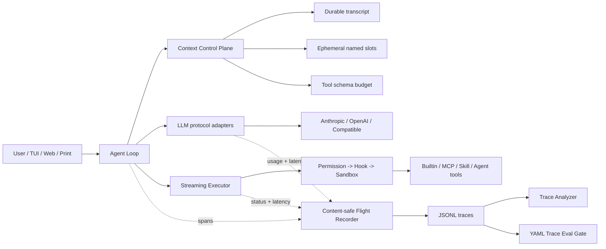

# DevMesh AI Coding Platform Architecture

DevMesh is a Java 21 local Agent runtime with governed context, observable execution, trace evaluation, MCP, Skills, memory, SubAgents, Teams, permissions, hooks, sandboxing, and worktrees.

## 1. Design goals

The platform organizes model calls, tools, context management, execution safety, and evaluation into one verifiable chain. After a run, the system can explain latency, token usage, tool reliability, early compaction, and policy compliance. Successful traces can become regression criteria for CI.

The main pillars are the Context Control Plane, Agent Flight Recorder, and Trace Eval, connected to MCP, Skill, and multi-agent execution.

## 2. Capabilities and design choices

| Area | Capability | Design choice |
| --- | --- | --- |
| Model calls | Anthropic, OpenAI Responses, and OpenAI-compatible streaming | Normalize model, usage, cache, finish reason, and latency in GenAI spans |
| Tools | Registry, parallel reads, ordered writes/commands, deferred ToolSearch | Emit a content-safe `execute_tool` span with deterministic result ordering |
| Context | Tool-result spill, stable replacement, usage anchors, summaries, recovery attachments | Keep named ephemeral slots separate from the durable transcript |
| MCP | stdio, Streamable HTTP, environment variables, remote tool wrappers | Include MCP tools in the same trace and preserve protocol extension boundaries |
| Skills | Built-in, user, and project layers; hot reload; inline/fork execution | Analyze Skill-triggered model and tool traces through the same evaluation chain |
| Multi-agent | Synchronous SubAgents, background tasks, Team, mailbox, shared tasks, worktrees | Use distinct identities and traces for cost and failure attribution |
| Security | Permission, pre/post Hook, Seatbelt/Bwrap, file-state cache | Detect Git Bash on Windows and terminate complete command trees on timeout |
| Engineering | Gradle, JUnit, executable fat JAR | Compile with JDK 21+ and produce Java 21 artifacts |

## 3. Overall architecture



### Context Control Plane

`ConversationManager` maintains durable transcript data and named ephemeral request slots such as `available-deferred-tools` and `plan-mode`. Durable messages are persisted, restored, and compacted. Ephemeral slots are added only to the next model request, can be replaced or removed, and do not pollute the session transcript.

Each turn can account for estimated history tokens, ephemeral tokens, tool-schema tokens, and context pressure. Prompt contents are not written to traces.

### Agent Flight Recorder

Each Agent writes an independent JSONL trace under `.devmesh/traces` by default. Events include `invoke_agent`, `chat`, `execute_tool`, usage, retry, compaction, and context-budget data. The default content-safe policy records parameter names but not values, prompts, messages, command text, path values, files, tool output, or API keys. Trace failures degrade silently so they do not break the main Agent loop.

### Trace Analyzer and Trace Eval

The analyzer aggregates one file or a directory and reports success/failure, model and tool calls, tool success rate, input/output/cache tokens, p50/p95 latency, retries, compactions, peak context pressure, and used tools. YAML Trace Eval policies are deterministic and offline, so they are suitable for CI. Policies can require or forbid specific tools.

## 4. Request lifecycle

1. Load instructions and memory.
2. Build schemas for discovered tools; MCP tools are deferred by default.
3. Update ephemeral Plan/ToolSearch state, spill oversized results, and compact when needed.
4. Record context budget without collecting context text.
5. Stream model text, thinking metadata, and tool calls through the LLM adapter.
6. Schedule independent read-only tools concurrently and preserve order for writes and commands.
7. Run each tool through Permission and Hook, then the implementation or MCP client.
8. Append results to the durable transcript and inject asynchronous memory recall when needed.
9. Close the root span so Analyzer and Eval can operate offline.

## 5. Build and verification

```powershell
.\gradlew.bat test
.\gradlew.bat shadowJar
java -jar .\build\libs\devmesh.jar --trace-report .\.devmesh\traces
java -jar .\build\libs\devmesh.jar `
  --trace-eval .\.devmesh\traces `
  --trace-policy .\evals\agent-reliability.yaml
```

| Environment variable | Purpose |
| --- | --- |
| `DEVMESH_TRACE=false` | Disable the local flight recorder |
| `DEVMESH_TRACE_DIR=/path` | Change the trace output directory |
| `DEVMESH_BASH=/path/bash` | Explicitly select the Hook command shell |

## 6. Current boundaries

Future directions include MCP resources/prompts/sampling, A2A interoperability, distributed trace context, multi-signal outcome evaluators, and cost-aware provider routing. These are intentionally separate from the current implementation and should not be described as shipped behavior.
