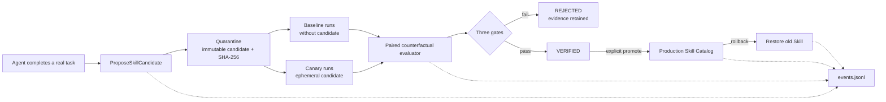

# DevMesh Architecture and Verified Skill Evolution

## 1. The design problem

DevMesh makes context governable, execution observable, and traces evaluable. Verified Skill Evolution addresses the next problem: how can successful Agent experience become reusable capability without allowing bad experience, prompt injection, or local overfitting into the production Skill catalog?

The system evolves Skills outside the model parameters. A candidate is isolated, evaluated, explicitly promoted, and recoverable through rollback.

## 2. Why verified evolution

| Approach | Value | Main risk |
| --- | --- | --- |
| Finer context routing | Lower tokens and latency | Does not explain how experience becomes capability |
| Large multi-agent orchestration | Parallel decomposition | Coordination cost and unnecessary complexity |
| Transactional tool execution | Safer external side effects | Requires compensation semantics per tool |
| **Verified Skill Evolution** | Converts experience into governed long-term capability | Requires isolation, evidence, provenance, and lifecycle management |

The fourth approach connects Agent, Skill, context, tools, observability, evaluation, and security into one causal workflow.

## 3. Static Skills versus verified evolution

| Question | Static Skill | Verified evolution |
| --- | --- | --- |
| How is new capability added? | A person edits a file | An Agent proposes a candidate from experience |
| When does it activate? | It may load as soon as the file exists | It starts in `QUARANTINED` and never activates automatically |
| How is it tested? | No dedicated candidate channel | A canary is injected into an ephemeral context |
| How is use proven? | Infer from output or files | Trace records candidate ID/version/hash and evaluation checks provenance |
| How is improvement measured? | A batch of rules | Paired baseline/candidate outcome, trajectory, and system gates |
| How is contamination controlled? | Manual caution | Hashes, quarantine, explicit promotion, backups, and rollback |
| How is history audited? | Current file state | Append-only events replay the lifecycle |

## 4. Lifecycle architecture



Core invariants:

1. The Agent has proposal authority, not promotion authority.
2. Candidate content is immutable; a new attempt creates a new version.
3. A canary exists only in the current request's ephemeral context.
4. A trace without the candidate ID cannot be evidence for that candidate.
5. Promotion requires the latest state to be `VERIFIED` and retains an old version for rollback.

## 5. Evidence gates

### Outcome gate

Baseline and candidate use the same `case_id` set. The evaluator requires matching sets, a minimum number of paired cases, and limits on failure-rate and score regression. Scores should come from a deterministic harness such as tests, static checks, or benchmark scoring.

### Trajectory gate

Reuse YAML Trace Eval to check tool failures, success rate, retries, compaction, context pressure, required/forbidden tools, and malformed JSONL. Candidate traces must contain a `skill_canary` span with the exact candidate ID, name, version, and hash.

### System non-regression

Compare reliability and cost metrics:

```text
candidate_failure_rate <= baseline_failure_rate + allowed_regression
candidate_tool_error_rate <= baseline_tool_error_rate + allowed_regression
candidate_tokens_per_run <= baseline_tokens_per_run * max_ratio
candidate_model_p95 <= baseline_model_p95 * max_ratio
```

With `require_strict_improvement: true`, at least one metric must improve strictly. This is a development gate, not a claim of statistical significance.

## 6. Storage and safety

```text
.devmesh/
|- evolution/
|  |- candidates/<candidate-id>/candidate.json
|  |- candidates/<candidate-id>/SKILL.md
|  |- releases/<skill-name>/...
|  |- events.jsonl
|  `- evolution.lock
`- skills/<promoted-skill>/SKILL.md
```

Candidates carry a SHA-256 hash. Lifecycle events are append-only and preserve policy hashes, trace/outcome paths, and aggregate evidence. JVM and file locks prevent duplicate versions. Promotion uses staging plus move; existing production Skills are backed up under releases. Rollback validates the backup before retiring the current version.

These controls provide engineering isolation, not a complete proof against malicious Skills. Canary runs still pass through Permission -> Hook -> Sandbox -> Tool execution.

## 7. Code map

| Component | Responsibility |
| --- | --- |
| `evolution/SkillCandidate.java` | Immutable procedural memory and Skill/canary rendering |
| `evolution/SkillEvolutionStore.java` | Candidate store, event sourcing, locks, promotion, rollback |
| `evolution/SkillOutcomeEvaluator.java` | Paired outcome evaluation |
| `evolution/SkillFitnessComparator.java` | Reliability and cost non-regression comparison |
| `evolution/SkillEvolutionService.java` | Provenance, outcome, trajectory, and system gates |
| `evolution/SkillEvolutionCli.java` | API-free lifecycle CLI |
| `tool/impl/ProposeSkillCandidateTool.java` | Proposal entry point; writes only quarantine |
| `agent/Agent.java` | Reads `DEVMESH_CANARY_SKILL` and injects the ephemeral candidate |
| `observability/TraceAnalyzer.java` | Finds `skill_canary` evidence |
| `evals/skill-evolution.yaml` | Three-gate policy |

## 8. Reproducible lifecycle

Build first:

```powershell
.\gradlew.bat clean test shadowJar
```

Create a candidate:

```powershell
$proposal = java -jar .\build\libs\devmesh.jar `
  --skill-evolution-propose .\examples\skill-evolution\safe-java-refactor.yaml `
  --workspace . --output-format json | ConvertFrom-Json
$candidateId = $proposal.id
```

Run the same benchmark cases once without `DEVMESH_CANARY_SKILL`, then again with it set to `$candidateId`. Keep trace directories separate. Prepare paired outcomes from the harness, run the Skill Evolution evaluation command, review the evidence, and promote only after an explicit human decision. Keep rollback available after promotion.
