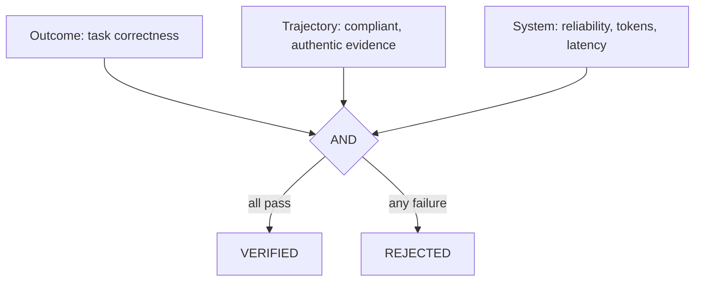

# Verified Skill Evolution: Advanced Guide

This guide assumes you understand the DevMesh Agent loop, Tool, MCP, Skill, context, and multi-agent execution. It focuses on the reasoning behind verified Skill evolution and on reproducible experiments.

## 1. The core tension

A static Agent can complete many tasks while its system prompt, tools, and human Skills remain unchanged. A natural improvement is to turn a successful experience into a Skill, but that introduces the risk of permanently learning an accidental success, prompt injection, repository-specific behavior, or an unsafe workaround.

Verified Skill Evolution therefore governs how a new capability enters long-term memory. The goal is not merely to generate a `SKILL.md`; it is to produce evidence before activation.

## 2. Procedural memory, not model fine-tuning

| Memory type | Stores | DevMesh example |
| --- | --- | --- |
| Episodic | Concrete events | Session transcript, trace, failure, and repair |
| Semantic | Abstract facts | This repository uses Gradle and its branch is `main` |
| Procedural | Repeatable methods | Preserve invariants before a refactor and run focused/full tests |

`SkillCandidate` distills episodic experience into procedural memory. External Skills are readable, versioned, attributable, separately evaluable, reversible, and independent of model weights. They still rely on model instruction-following, so they are not equivalent to deterministic code.

## 3. Experience distillation

A reusable candidate should answer:

1. What repeated problem does it solve?
2. What preconditions make it applicable?
3. When should it not be used?
4. Which failure modes have been observed?
5. Which deterministic checks prove completion?

`ProposeSkillCandidate` therefore collects `when_to_use`, `failure_modes`, and `validation_checks`, rather than accepting only an unbounded paragraph of advice.

Avoid copying task-specific details into a long-lived Skill:

```text
Bad: edit D:/project/Foo.java line 42 and replace x with y.
Good: before changing a public method signature, find callers, state compatibility invariants, and run contract tests.
```

## 4. Quarantine and canary

An Agent must not be able to generate a Skill and immediately load it into every future task. `ProposeSkillCandidateTool` writes under `.devmesh/evolution/candidates` and never directly writes to `.devmesh/skills`.

A canary is the Agent equivalent of a limited software release:

```text
Normal run: durable context + production Skills
Canary run: durable context + production Skills + one ephemeral candidate
```

The candidate is injected through `ConversationManager.setEphemeralContext("canary-skill:<id>", ...)`. It affects only that run, is not persisted in the session transcript, is not compacted into long-term history, and remains subject to Permission, Hook, and Sandbox checks.

## 5. Counterfactual A/B evaluation

Candidate success alone is not evidence of causation. The same Agent must run the same task cohort without the candidate and with the candidate, using the same model, parameters, permissions, environment, and scoring method.

`SkillOutcomeEvaluator` requires identical `case_id` sets so task difficulty is controlled. The main comparison is non-inferiority:

```text
candidate failure rate <= baseline failure rate + allowed regression
candidate score >= baseline score - allowed regression
candidate tokens/run <= baseline tokens/run * allowed ratio
```

`require_strict_improvement` can require at least one system metric to improve. This is an engineering gate, not a statistical-significance claim; production conclusions need more samples, repetitions, confidence intervals, and variance analysis.

## 6. Multi-objective fitness

A candidate may improve correctness while increasing tokens, reduce latency while increasing tool errors, or improve one benchmark while regressing another. DevMesh therefore uses three hard gates rather than one arbitrary weighted score:



A future Pareto selector could retain candidates with different accuracy/cost tradeoffs. The current implementation provides gates, not multi-candidate Pareto ranking.

## 7. Provenance and event sourcing

Canary injection records `operation = skill_canary`, `candidate_id`, `skill_name`, `version`, `content_hash`, and `status`. `TraceAnalyzer` collects candidate IDs and `SkillEvolutionService` rejects evidence whose ID does not exactly match the candidate under evaluation.

Lifecycle state is reconstructed from append-only facts instead of a single overwritten status:

```text
PROPOSED -> QUARANTINED
EVALUATION_FAILED -> REJECTED
EVALUATION_PASSED -> VERIFIED
PROMOTED -> PROMOTED
ROLLED_BACK -> ROLLED_BACK
```

Content hashes detect tampering. Event sourcing preserves the policy, trace paths, outcome paths, and evidence needed to audit why a candidate was promoted or rejected.

## 8. Hands-on workflow

```powershell
.\gradlew.bat clean test shadowJar
```

1. Propose a candidate with `--skill-evolution-propose` and inspect its immutable metadata.
2. Run every benchmark case with a fresh baseline trace directory and no `DEVMESH_CANARY_SKILL`.
3. Run the exact same cases with `DEVMESH_CANARY_SKILL` set to the candidate ID.
4. Generate paired outcome JSONL from a deterministic harness.
5. Run the outcome, trajectory, and system gates.
6. Review the candidate content and provenance before explicit promotion.
7. Keep the release backup available and test rollback after promotion.

The most important review question is simple: can every metric used for promotion be traced to the exact candidate, exact task cohort, and exact policy that produced it?
