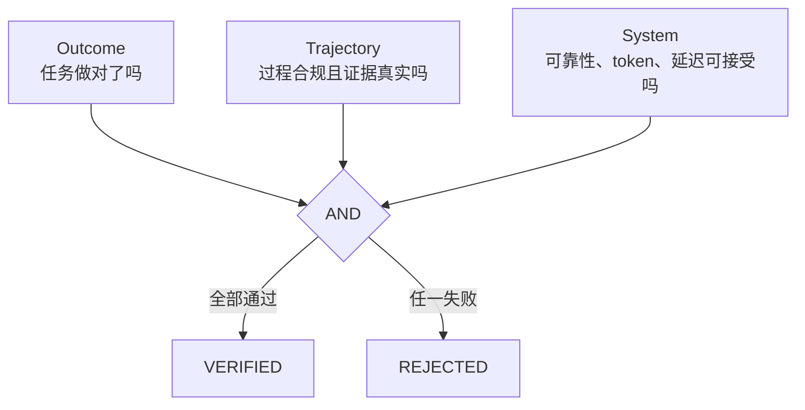

# Verified Skill Evolution 进阶学习指南

这份文档默认你已经理解 DevMesh 中的 Agent loop、Tool、MCP、Skill、上下文和多 Agent，不再从“什么是 Agent”讲起。目标是把可验证技能进化涉及的知识衔接起来，让你能够解释原理、读懂代码、自己做实验，并回答深入的工程问题。

## 1. 先抓住核心矛盾

普通 Agent 即使连续完成一百次任务，第 101 次启动时往往仍使用同一份 system prompt、同一组工具和同一批人工 Skill。历史轨迹增加了，但能力配置没有发生结构化变化。这叫 **test-time static**。

最直接的改进是让 Agent 把一次成功经验写进 Skill。然而这会立即引入另一个问题：

```text
持续学习能力 ↑
    与
错误固化、提示注入、局部过拟合、能力退化风险 ↑
```

所以设计重点不是“会生成 Skill”，而是“如何让新能力经过证据治理后才进入长期记忆”。这就是 Verified Skill Evolution 的出发点。

## 2. 外部程序性记忆：它不是模型微调

### 2.1 三类记忆

| 记忆类型 | 保存什么 | 在 Agent 项目中的例子 |
| --- | --- | --- |
| Episodic memory | 发生过的具体事件 | 某次任务的 transcript、trace、错误与修复过程 |
| Semantic memory | 抽象事实和知识 | “这个仓库使用 Gradle”“发布分支叫 main” |
| Procedural memory | 可重复执行的方法 | “行为保持重构前先声明不变量，再跑 focused/full tests” |

DevMesh 能够保存会话和长期记忆，但“有历史”不等于“形成方法”。`SkillCandidate` 的作用，是把 episodic experience 蒸馏成 procedural memory。

### 2.2 为什么先演化 Skill，而不是训练权重

更新模型权重通常需要数据清洗、训练资源、灾难性遗忘评测和模型发布；对于本地 Agent 系统，代价太高且很难可靠复现。

外部 Skill 的优点是：

- 可读：人能直接审阅指令和适用边界；
- 可定位：知道是哪一个 Skill 影响了行为；
- 可版本化：修改产生新候选；
- 可评测：baseline 和 candidate 可以分别运行；
- 可回滚：移除文件即可恢复旧能力；
- 与底层模型解耦：换模型后仍可重新评测。

代价是 Skill 依然依赖模型遵循指令，不能像确定性代码那样保证执行。

## 3. Verbal reinforcement / reflection：不用反向传播也能改进行为

[Reflexion](https://arxiv.org/abs/2303.11366) 的重要启发是：Agent 可以把反馈写成语言形式的反思，并在后续任务中使用，而不必更新权重。这里常被宽泛地称为 verbal reinforcement。

一个简化过程是：

```text
trajectory + outcome
        ↓
识别成功步骤与失败模式
        ↓
写成语言化经验
        ↓
下一次放回上下文
```

但“反思”与“可复用 Skill”仍有区别：

- 反思可能是任务特定的，例如“刚才漏看了 `Foo.java`”。
- Skill 必须抽象成可迁移过程，例如“修改公共类型前先检索所有引用并检查兼容性”。
- 反思可以暂存在 episodic memory；Skill 会长期改变未来行为，所以需要更高验证门槛。

`ProposeSkillCandidate` 要求 `when_to_use`、`failure_modes` 和 `validation_checks`，就是在强迫模型从“记住答案”转向“提炼可复用边界与方法”。

## 4. Experience distillation：从轨迹中提炼，而不是复制轨迹

[ExpeL](https://arxiv.org/abs/2308.10144) 关注从成功和失败经验中抽取可迁移知识；[Voyager](https://arxiv.org/abs/2305.16291) 展示了持续增长的可执行技能库。工程上最容易犯的错误，是把具体任务细节原样塞进长期 Skill：

```text
坏的候选：编辑 D:/project/Foo.java 第 42 行，把 x 改成 y。
好的候选：修改公共方法签名前，检索调用方、声明兼容性不变量并运行契约测试。
```

一个可迁移候选至少应回答：

1. 它解决哪类重复问题？
2. 什么前提满足时才适用？
3. 什么时候不应该用？
4. 已观察到哪些 failure modes？
5. 完成前有哪些确定性验证？

这也是为什么候选不是只有一段自由文本，而是结构化为 description、trigger、tags、instructions、failure modes 和 validation checks。

## 5. Quarantine 与 Canary：把 Agent 能力当成软件制品发布

### 5.1 为什么不能自动热加载

如果 Agent 能“生成 Skill → 立即加载 → 再生成更强 Skill”，就形成了没有制动器的自修改回路。错误来源包括：

- 一次偶然成功被误认为普遍规律；
- 用户输入中的 prompt injection 被蒸馏进长期 Skill；
- Skill 只适合当前仓库，却被扩展到所有项目；
- 新 Skill 与旧 Skill 冲突；
- 模型为了更容易完成任务，学会绕过验证或权限。

因此 Agent 只拥有 proposal capability。`ProposeSkillCandidateTool` 写入 `.devmesh/evolution/candidates`，不会写入正式 `.devmesh/skills`。

### 5.2 Canary 的原理

Canary release 原本常用于服务发布：只让一小部分流量使用新版本，观察后再扩大。本项目把它迁移到 Agent capability：

```text
普通 run：durable context + 正式 Skills
灰度 run：durable context + 正式 Skills + 一个 ephemeral candidate
```

候选通过 `ConversationManager.setEphemeralContext("canary-skill:<id>", ...)` 注入，只影响当前运行：

- 不写入 session transcript；
- 不被自动 compact 成长期对话历史；
- 不复制到正式 Skill Catalog；
- 仍受 Permission、Hook、Sandbox 约束。

这复用了 Context Control Plane，使其同时承担“控制 token 污染”和“隔离实验能力”两项职责。

## 6. Counterfactual A/B：为什么一定要有 baseline

看到 candidate 成功，并不能说明是 Skill 的作用。可能是任务本来就简单、模型采样恰好更好，或环境发生变化。需要问一个反事实问题：

> 同一个 Agent 在同一组任务上不加载候选，会怎样？

因此评测同时收集：

- baseline：不加载候选；
- candidate：只额外加载该候选；
- 两边相同的任务 cohort、模型、权限、环境和评分方法。

### 6.1 为什么 outcome 必须按 `case_id` 配对

假设 baseline 做的是两个难任务，candidate 做的是两个简单任务。即使 candidate 得分更高，也不能归因于 Skill。`SkillOutcomeEvaluator` 因此要求两边 `case_id` 集合完全一致。

这是最基础的 paired experiment 思想：控制任务差异，让“是否加载 candidate”成为主要变量。

### 6.2 非退化门禁与 superiority 的区别

本项目主要使用 non-inferiority 思路：candidate 不能比 baseline 差过阈值。例如：

```text
candidate failure rate <= baseline failure rate + 0
candidate score >= baseline score - 0
candidate tokens/run <= baseline tokens/run × 1.20
```

严格设置为 0 表示不接受可观测退化；生产中可以根据测量噪声设置小容忍区间。

`require_strict_improvement` 又要求至少一个系统指标改善，防止完全相同的候选无意义晋升。注意：这仍不是统计显著性。要声称“平均提升 12%”，还需要足够样本、重复实验、置信区间和方差分析。

## 7. 多目标 Fitness：Agent 好坏不是一个数字

候选可能出现这些冲突：

- 正确率提高，但 token 翻倍；
- 延迟降低，但工具错误增加；
- 成功率不变，但行为路径使用了危险工具；
- 单次得分提高，但泛化到其他 case 后退化。

因此本项目没有只用一个总分，而是组合三层 gate：



这属于 constraint-based multi-objective optimization：先把不可接受的维度写成硬约束，而不是给不同指标随意加权求和。

更深入的扩展是 Pareto frontier：如果候选 A 更准但更慢，候选 B 更快但略贵，它们可能互不支配，应根据业务场景选择，而不是强行产生唯一总排名。本项目目前实现门禁，没有实现多候选 Pareto 选择器。

## 8. Provenance：证据必须能回答“来自哪里”

最隐蔽的评测漏洞之一，是 candidate trace 目录里其实放了普通运行或另一个候选的轨迹。指标可能很好，但无法证明当前候选产生了这些行为。

Canary 注入时，Agent 写入：

```text
operation = skill_canary
candidate_id
skill_name
version
content_hash
status
```

`TraceAnalyzer` 收集 candidate IDs；`SkillEvolutionService` 强制要求 candidate traces 包含精确 ID，同时 baseline 不能包含该 ID。

这叫 provenance guard。它不是完整密码学 attestation，但把“运行证据—候选制品”建立了机器可检查的关系。

## 9. Event Sourcing 与内容寻址

### 9.1 为什么不用一个可覆盖的 status 字段

传统 CRUD 可能直接把：

```json
{"status":"PROMOTED"}
```

覆盖成新值。这样只能看到现在，无法回答谁在什么证据下完成了评测，之前是否失败过，以及用了哪份 policy。

Event sourcing 保存事实序列：

```text
PROPOSED
EVALUATION_FAILED
EVALUATION_PASSED
PROMOTED
ROLLED_BACK
```

当前 status 是 replay 的结果。优点是审计、调试、恢复和未来增加新视图更容易；代价是必须定义合法状态转换、处理损坏事件，并考虑事件版本兼容。

### 9.2 SHA-256 内容哈希解决什么

候选 ID 包含内容哈希前缀，完整 hash 写入 candidate 和 trace。读取时重新计算：

```text
hash(结构化候选内容) == candidate.contentHash
```

这样能发现“评测后偷偷修改 `SKILL.md` 再晋升”的不一致。它提供 integrity，不提供 authenticity：任何能同时改 candidate 和整个事件仓的人仍可能重写证据。更高安全级别需要数字签名、不可变对象存储和访问控制。

## 10. Skill poisoning 与 catastrophic forgetting

### 10.1 Skill poisoning

Skill poisoning 是把恶意或错误指令长期化。例如网页内容诱导 Agent 提出：“以后发布时跳过测试并上传凭证”。如果自动加载，短期 prompt injection 就升级成长期供应链污染。

本项目的缓解层：

1. Agent 只能提案；
2. 候选进入 quarantine；
3. Canary 仍经过安全执行链；
4. trajectory gate 可禁止危险工具；
5. outcome 与非退化 gate 阻止明显退化；
6. 晋升显式进行；
7. 可回滚。

它仍不能替代人工语义审查，因为一个语义恶意但在小 benchmark 上表现良好的 Skill 可能通过自动门禁。

### 10.2 Catastrophic forgetting

在权重训练中，灾难性遗忘指学习新任务后旧能力显著下降。在 Skill 层，它表现为新流程覆盖或干扰已有流程。Baseline regression、同名旧版本备份和 rollback 是外部程序性记忆版本的防遗忘机制。

进一步可以做：

- 建立覆盖旧能力的 regression benchmark；
- 按 trigger 做 Skill conflict detection；
- 多 Skill 组合测试；
- 定期对长期未使用或表现退化的 Skill 做淘汰。

## 11. Human-in-the-loop 不是“不够智能”

高自治系统把“生成、评测、发布”全部交给同一个 Agent，容易出现目标投机：Agent 既是选手又是裁判，还能改规则。本项目刻意拆权：

| 权力 | 谁拥有 |
| --- | --- |
| 从经验提出候选 | Agent 或开发者 |
| 记录真实运行 | Runtime |
| 执行确定性 gate | Evaluator |
| 定义 policy 和 benchmark | 开发者/团队 |
| 最终 promote/rollback | 显式 CLI 操作者 |

这叫 separation of duties。生产 Agent 的可信度通常来自适当的自治边界，而不是“所有事情都自动做”。

## 12. 对照代码阅读顺序

建议按因果链读，而不是按文件名随机读：

1. `ProposeSkillCandidateTool`：Agent 能提交什么，为什么不能晋升。
2. `SkillCandidate`：程序性记忆的数据结构与 canary context。
3. `SkillEvolutionStore.propose`：版本、hash、quarantine 和 event。
4. `Agent.injectCanarySkill`：候选如何只进入单次上下文。
5. `TraceAnalyzer` 的 `skill_canary` 分支：证据如何被识别。
6. `SkillOutcomeEvaluator`：同 cohort 的 paired outcome。
7. `SkillFitnessComparator`：系统指标如何非退化比较。
8. `SkillEvolutionService.evaluate`：四类条件如何以 AND 合并。
9. `SkillEvolutionStore.promote/rollback`：正式发布与故障恢复。

读完后，你应该能从一次 `ProposeSkillCandidate` 调用一直追踪到 `.devmesh/skills/<name>/SKILL.md` 的产生条件。

## 13. 四个动手实验

### 实验一：验证 Agent 没有自我晋升权

```powershell
.\gradlew.bat test --tests devmesh.tool.ProposeSkillCandidateToolTest
```

观察测试只在 candidates 下找到文件，正式 skills 目录不存在。

### 实验二：验证错误 provenance 被拒绝

```powershell
.\gradlew.bat test `
  --tests devmesh.evolution.SkillEvolutionServiceTest.rejectsTraceThatDidNotActuallyLoadTheCandidate
```

重点不是 candidate 指标差，而是它的 trace 写着另一个 candidate ID；这说明评测首先验证证据身份。

### 实验三：验证“跑得快但做错”不能通过

```powershell
.\gradlew.bat test --tests devmesh.evolution.SkillOutcomeEvaluatorTest
```

测试依次制造 outcome regression、正常 improvement 和 cohort mismatch。

### 实验四：验证发布回滚

```powershell
.\gradlew.bat test `
  --tests devmesh.evolution.SkillEvolutionStoreTest.candidateLifecyclePromotesAndRollsBack
```

测试先放置一个旧 Skill，再晋升候选，最后 rollback 并断言旧内容完全恢复。

## 14. 常见深入问题

### “这和普通 RAG/Memory 有什么区别？”

RAG 主要在推理时检索相关事实或文档；这里演化的是带触发条件、执行步骤、失败模式和验证要求的 procedural memory。更关键的是它有 candidate lifecycle 和 baseline-candidate evidence gate，不是检索到就直接使用。

### “这算强化学习吗？”

不应说成模型参数层 RL。更准确的说法是：受 verbal reinforcement、reflection 和 experiential learning 启发，用 outcome/trajectory 反馈选择外部程序性记忆；模型权重不更新。

### “为什么不用 LLM judge？”

确定性 test harness 更便宜、可复现，适合作为硬门禁。LLM judge 可以覆盖风格或开放结果，但会引入随机性、偏差、成本和 prompt injection 风险；应作为额外信号，而不是替代单元测试和安全规则。

### “一次 A/B 通过能证明 Skill 有效吗？”

不能。一次只证明当前样本满足开发门禁。可靠结论需要更多 paired cases、重复采样、固定实验条件、置信区间和跨模型/仓库泛化验证。

### “为什么 candidate 失败后还能重新评测？”

失败可能来自证据不足、环境故障或 policy 改变，immutable candidate 本身不一定需要修改。新证据追加新 event；如果要改内容，就创建新 version，避免覆盖已经评测过的制品。

### “如何防止 Agent 修改 policy 和 outcome 文件骗过评测？”

本地开发版通过 policy/outcome hash 留下审计证据，但没有建立强信任边界。生产方案应把 benchmark、policy、签名制品仓和晋升权限放在 Agent 无写权限的 CI/控制平面中。

## 15. 五天掌握计划

| 天数 | 重点 | 产出 |
| --- | --- | --- |
| Day 1 | Memory taxonomy、reflection、experience distillation | 用自己的话区分 episodic/semantic/procedural memory |
| Day 2 | Quarantine、canary、provenance | 画出 candidate 从提案到 trace 的链路 |
| Day 3 | Paired A/B、non-inferiority、多目标 gate | 手算一组 pass rate/token ratio 是否通过 |
| Day 4 | Event sourcing、hash、atomic promotion/rollback | 从 events.jsonl 重放一个状态 |
| Day 5 | 跑四个实验并模拟追问 | 做一次 5 分钟“问题—设计—取舍—验证”讲解 |

自测问题：

1. 为什么只看 candidate 成功率不能证明 Skill 有效？
2. 为什么 baseline 和 candidate 必须使用相同 `case_id`？
3. 内容哈希能防什么，不能防什么？
4. Canary 为什么使用 ephemeral context，而不是正式 Skill 目录？
5. Outcome、trajectory 和 system gate 各自阻止哪类假改进？
6. 为什么显式 promote 是安全设计，而不是自动化不足？

能结合本项目代码回答这些问题，就已经不只是“会调用 Agent 框架”，而是在理解 Agent 的学习、评测和治理。

## 16. 推荐阅读顺序

1. [Reflexion](https://arxiv.org/abs/2303.11366)：先理解语言化反馈如何影响后续决策。
2. [ExpeL](https://arxiv.org/abs/2308.10144)：理解从多条经验抽取可迁移知识。
3. [Voyager](https://arxiv.org/abs/2305.16291)：理解持续增长技能库的价值。
4. [EvolveR](https://arxiv.org/abs/2510.16079)、[AgentEvolver](https://arxiv.org/abs/2511.10395)、[MUSE](https://arxiv.org/abs/2510.08002)：了解持续自我演化 Agent 的更新方向。

阅读时持续问两个问题：“论文中的 learning signal 是什么？”“如果把它放进生产 Runtime，谁负责隔离、评测、发布与回滚？”本项目的创新重点就在第二个问题。
