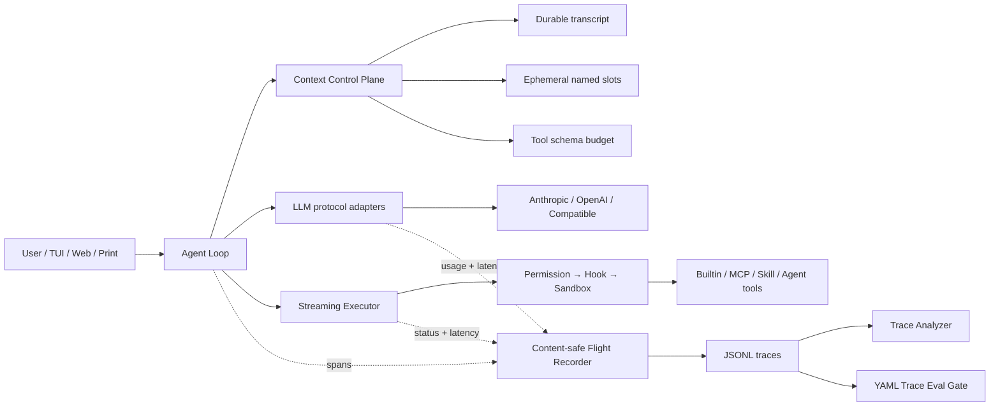

# DevMesh 智能编程平台架构说明

如果你对 Context Engineering、Trace、Eval、MCP 或多 Agent 还不熟悉，请先阅读 [Agent 运行机制学习指南](Agent运行机制学习指南.md)。

## 1. 设计目标

DevMesh 覆盖模型调用、Tool、MCP、Skill、记忆、上下文压缩、子 Agent、Team、权限、Hook、Sandbox 和 Worktree。平台的核心工程目标是把这些能力组织成一条可验证的调用链：一次 Agent 运行结束后，能够解释延迟来自哪里、token 消耗在哪个阶段、工具是否可靠、上下文是否过早压缩，并把成功轨迹转化为持续集成中的回归标准。

DevMesh 的技术定位是：

> 一个 Java 21 实现的、上下文可治理、执行可观测、轨迹可评测的本地 Agent Runtime。

主线由 Context Control Plane、Agent Flight Recorder 和 Trace Eval 三部分组成，并直接贯穿 MCP、Skill 与多 Agent 执行链。

## 2. 核心能力与设计

| 领域 | 平台能力 | 设计要点 |
| --- | --- | --- |
| 模型调用 | Anthropic、OpenAI Responses、OpenAI-compatible，流式文本/思考/tool call | 用统一 GenAI span 归一化模型、usage、cache、finish reason 和延迟 |
| 工具系统 | Registry、读工具并行、写/命令顺序、ToolSearch 延迟发现 | 每次调用产生脱敏 `execute_tool` span，同时保持确定的结果顺序 |
| 上下文 | 工具结果 spill、稳定替换、usage anchor、自动摘要、恢复附件 | 具名 ephemeral slot 与 transcript 分离，可覆盖、可删除且不污染持久历史 |
| MCP | stdio、Streamable HTTP、环境变量、远端工具包装、schema 延迟加载 | MCP Tool 纳入统一 trace，并保留 resources、prompts 等协议能力的扩展边界 |
| Skill | builtin/user/project 三级覆盖、热加载、inline/fork、上下文继承 | Skill 触发后的模型与工具轨迹可由同一套评测链分析 |
| 多 Agent | 同步子 Agent、后台任务、Team、mailbox、shared task、worktree | 通过独立 agent identity 与 trace 区分调用、成本和失败 |
| 安全 | Permission、pre/post Hook、Seatbelt/Bwrap、文件状态缓存 | Windows 优先发现 Git Bash，命令超时时终止完整进程树 |
| 工程化 | Gradle、JUnit、fat JAR | 使用 JDK 21+ 编译并生成 Java 21 目标产物 |

## 3. 总体架构



### 3.1 Context Control Plane

`ConversationManager` 现在维护两类状态：

1. **Durable transcript**：用户消息、模型输出、工具结果、长期记忆等，可保存、恢复和压缩。
2. **Ephemeral context slots**：只在下一次推理请求的 context envelope 中呈现，不写入 session，不参与历史重放。

每个 slot 有稳定 key，例如 `available-deferred-tools`、`plan-mode`。同一 key 在下一轮只会更新，不会新增一条历史消息；退出模式或工具全部发现后可直接移除。这样既保留模型所需的当前状态，也保持 Anthropic prompt cache 所依赖的持久前缀稳定。

每轮还会计算：

- history estimated tokens；
- ephemeral estimated tokens；
- tool schema estimated tokens；
- context window pressure。

这些数据进入 trace，而 prompt 内容不进入 trace。

### 3.2 Agent Flight Recorder

每个 Agent 启动时创建独立 JSONL trace，默认目录为 `.devmesh/traces`。字段参考 OpenTelemetry GenAI semantic conventions：

- `invoke_agent {agent}`：一次 Agent 生命周期；
- `chat {model}`：一次流式模型调用；
- `execute_tool {tool}`：一次本地或 MCP 工具执行；
- `gen_ai.usage.*`：输入、输出、cache read、cache creation；
- `retry`、`compact_context`、`context_budget`：DevMesh Runtime 扩展事件。

默认采用 content-safe 策略：只记录参数 key，不记录参数 value；不记录 system prompt、用户消息、思维内容、命令、路径值、文件内容、工具输出或 API Key。Trace 写入失败会静默降级，不影响 Agent 主调用链。

### 3.3 Trace Analyzer 与 Trace Eval

Analyzer 支持单文件或目录聚合，输出：

- Agent 成功/失败次数；
- 模型/工具调用次数；
- 工具成功率；
- input/output/cache token；
- 模型与工具 p50/p95 延迟；
- retry、compact 次数；
- 峰值 context pressure；
- 实际使用过的工具集合。

Trace Eval 使用 YAML 声明确定性门禁，不再次请求模型，因此便宜、可重复、适合 CI。除通用可靠性策略外，还能为具体场景声明 `required_tools` 和 `forbidden_tools`，把“模型大概能完成”转成“轨迹必须满足哪些行为约束”。

## 4. 调用链细节

一次普通工具轮次如下：

1. Agent 读取长期指令和记忆。
2. Tool Registry 按当前已发现能力生成 schema；MCP 工具默认 deferred。
3. Context Control Plane 更新 Plan/ToolSearch ephemeral slot，应用大结果 spill 与自动 compact。
4. Runtime 记录 context budget，不采集上下文正文。
5. LLM adapter 流式返回文本、thinking metadata 和 tool call；记录统一 chat span。
6. Streaming Executor 将连续只读工具并行调度，写/命令工具保持顺序。
7. 每个工具经过 Permission、Hook，再进入具体实现或 MCP client；记录 execute_tool span。
8. 工具结果回填 durable transcript；必要时在下一轮注入异步 memory recall。
9. Agent 完成后写入 invoke_agent 根 span；Analyzer/Eval 可完全离线运行。

## 5. 运行与验证

```powershell
# 全量测试
.\gradlew.bat test

# 构建可执行 fat JAR
.\gradlew.bat shadowJar

# 正常运行一次 Agent 后查看轨迹
java -jar .\build\libs\devmesh.jar --trace-report .\.devmesh\traces

# CI 质量门禁，失败退出码 2
java -jar .\build\libs\devmesh.jar `
  --trace-eval .\.devmesh\traces `
  --trace-policy .\evals\agent-reliability.yaml
```

环境变量：

| 名称 | 作用 |
| --- | --- |
| `DEVMESH_TRACE=false` | 关闭本地 flight recorder |
| `DEVMESH_TRACE_DIR=/path` | 修改 trace 输出目录 |
| `DEVMESH_BASH=/path/bash` | 显式指定 Hook command shell |

## 6. 简历写法

可直接根据实际投递篇幅压缩为以下三条：

- 基于 Java 21 虚拟线程实现多协议 Coding Agent Runtime，统一 Anthropic/OpenAI/兼容接口的流式输出、tool calling、usage 与 prompt cache 指标，并接入 MCP、Skill、子 Agent/Team 和 Worktree 隔离。
- 设计 Context Control Plane，将持久 transcript 与具名 ephemeral context slot 分离，结合 tool-result spill、真实 usage anchor、分层 compact 和恢复附件，解决循环提示累积与长会话上下文退化问题。
- 参考 OpenTelemetry GenAI 语义实现默认脱敏的 Agent Flight Recorder 与 YAML Trace Eval，在不重复调用模型的情况下评估 token/cache、工具成功率、p50/p95 延迟、重试/压缩和行为约束，可作为 CI 质量门禁。

介绍系统时不要只列模块。建议围绕一个具体问题讲清：原来每轮 reminder 会永久进入 history；为什么这会影响 context window 和 prompt cache；ephemeral slot 如何保持当前状态但不污染持久前缀；最后如何用 trace 中的 context pressure、cache token 和 compact 次数验证收益。

## 7. 后续路线（未伪装为已实现）

以下方向有价值，但当前版本尚未实现：

1. **MCP 新能力**：在 Java SDK稳定支持后扩展 resources、prompts、sampling、elicitation 和 durable tasks，并做 capability negotiation。
2. **A2A**：为 RemoteServer 发布 Agent Card，并把本地 Team task 映射到 A2A task/artifact；需要先补认证、幂等和持久状态机。
3. **Trace 关联**：当前每个 Agent 是独立 trace；下一步可传播 trace/span context，形成主 Agent → 子 Agent → MCP 的完整分布式链路。
4. **Outcome evaluator**：加入代码测试、静态检查和 LLM-as-judge 的多信号评测；当前质量门禁只做确定性 trajectory gate。
5. **成本路由**：给 Provider 增加价格、延迟 SLO 与能力标签，基于任务复杂度和剩余预算选择模型，而不是仅靠固定 model override。

这些边界也值得在设计评审中讨论：需要区分“协议存在”“SDK 支持”“工程上可靠落地”三个层次。
