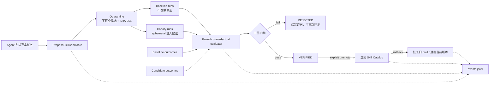

# DevMesh 架构设计与可验证技能进化

## 1. 设计问题

在上下文可治理、执行可观测、轨迹可评测的基础上，DevMesh 进一步解决一个更接近 Agent 研究与生产落地的问题：

> Agent 完成很多任务后，如何把经验变成下一次可复用的能力，同时又不让错误经验、提示注入或局部过拟合污染正式能力？

Verified Skill Evolution 的目标是：

> 一个能把运行经验蒸馏成程序性记忆，并经过隔离灰度、配对反事实评测、显式晋升和可恢复回滚后再投入使用的 Java Agent Runtime。

这里的“进化”不修改模型参数，而是演化 Runtime 外部的 Skill。它比“让模型写一个 `SKILL.md` 并立即加载”多出完整的证据与治理链。

## 2. 为什么采用可验证技能进化

设计阶段比较过四类路线：

| 路线 | 价值 | 适用重点 | 风险/代价 |
| --- | --- | --- | --- |
| 更精细的上下文路由 | 降低 token 和延迟 | 上下文性能优化 | 难以回答经验如何沉淀为能力 |
| 大规模多 Agent 编排 | 展示并行与协作 | 复杂任务分解 | 协调成本高，容易“为了多 Agent 而多 Agent” |
| Agent 事务与补偿执行 | 强化外部副作用安全 | 工具副作用治理 | 需要为每类 Tool 定义补偿语义，实现范围较大 |
| **可验证技能进化** | Agent 从经验形成长期能力，同时抑制错误学习 | 能力沉淀与发布治理 | 需要候选隔离、评测、溯源和生命周期治理 |

最终选择第四条，因为它把 Agent、Skill、上下文、Tool、可观测性、Eval 与安全治理串成一条因果主线，而不是堆叠功能名。

## 3. 静态 Skill 与可验证进化的差异

| 问题 | 静态 Skill 模式 | DevMesh 可验证进化模式 |
| --- | --- | --- |
| Agent 是否会积累新流程 | Skill 由人预先编写，运行期基本静态 | Agent 可用工具从具体经验提出候选 Skill |
| 新知识何时生效 | 文件存在后可能直接被 Skill Catalog 加载 | 先进入 `QUARANTINED`，绝不自动激活 |
| 如何试运行 | 缺少独立候选通道 | 通过 ephemeral context 只对指定 run 注入 canary candidate |
| 如何证明候选被用过 | 只能根据文件或输出猜测 | trace 写入 candidate ID/version/hash，评测强制检查 provenance |
| 如何判断“变好” | 单批轨迹规则 | 同任务 baseline/candidate 的 outcome + trajectory + system 三层门禁 |
| 如何防止只优化成本却损害正确性 | 没有配对结果约束 | 相同 `case_id` 队列必须匹配，成功率和 score 不允许退化 |
| 如何处理 Skill 污染 | 依靠人工谨慎 | 内容哈希、隔离区、显式晋升、旧版本备份、可回滚 |
| 如何审计历史 | 读取当前文件状态 | append-only events 重放出完整生命周期 |

该机制依赖 Context Control Plane 和 Agent Flight Recorder，形成“观察经验 → 生成候选 → 灰度运行 → 证据评测 → 晋升/回滚”的闭环。

## 4. 架构



核心不变量：

1. Agent 只有“提案权”，没有“自我晋升权”。
2. Candidate 内容创建后不可修改；新尝试产生新 version。
3. Canary 只存在于当次模型请求的 ephemeral context，不写入持久 transcript，也不进入正式 Skill 目录。
4. 没有候选 ID 的 trace 不能成为该候选的证据。
5. 晋升必须基于最新状态 `VERIFIED`，并保留旧版本以便回滚。

## 5. 三层证据门禁

### 5.1 Outcome gate：任务结果没有退化

Baseline 和 candidate 使用同一组 `case_id`：

```json
{"case_id":"extract-method-with-tests","passed":true,"score":0.9}
```

评测器要求两边 case 集合完全一致，再比较：

- 配对 case 数量是否达到最小值；
- candidate failure rate 是否超过允许退化量；
- candidate mean score 是否低于允许退化量。

这是结果层证据。`score` 由场景的确定性 harness 产生，例如测试通过比例、静态检查得分或 benchmark 自带评分。不要把主观填写的 score 当作可靠评测。

### 5.2 Trajectory gate：执行路径满足约束

继续复用 YAML Trace Eval，检查：

- Agent/Tool 失败数；
- 工具成功率、重试、压缩和上下文压力；
- required/forbidden tools；
- JSONL 是否存在损坏记录。

此外，candidate trace 必须包含 `skill_canary` span 且 `devmesh.skill.candidate_id` 与当前候选完全一致。这样“拿一次普通成功运行冒充候选运行”会被拒绝。

### 5.3 System non-regression：可靠性和成本没有不可接受的退化

将 baseline 与 candidate 聚合指标做 A/B 比较：

```text
candidate_failure_rate <= baseline_failure_rate + allowed_regression
candidate_tool_error_rate <= baseline_tool_error_rate + allowed_regression
candidate_tokens_per_run <= baseline_tokens_per_run × max_ratio
candidate_model_p95 <= baseline_model_p95 × max_ratio
```

`require_strict_improvement: true` 时，失败率、工具错误率、token/run 或 p95 至少有一项严格改善。它不是统计显著性检验；样本很少时只能作为开发门禁，不能宣称具有科学意义的性能提升。

## 6. 状态、存储与安全边界

状态由事件重放得到：

```text
PROPOSED → QUARANTINED
EVALUATION_PASSED → VERIFIED
EVALUATION_FAILED → REJECTED
PROMOTED → PROMOTED
ROLLED_BACK → ROLLED_BACK
```

失败候选内容保持不可变，但可以用新证据重新评测；需要修改内容时必须再提出新 version。

本地目录结构：

```text
.devmesh/
├─ evolution/
│  ├─ candidates/<candidate-id>/candidate.json
│  ├─ candidates/<candidate-id>/SKILL.md
│  ├─ releases/<skill-name>/...
│  ├─ events.jsonl
│  └─ evolution.lock
└─ skills/<promoted-skill>/SKILL.md
```

- `candidate.json` 带 SHA-256；读取时重新计算，内容被篡改会失败。
- 生命周期事件只追加不覆盖，并保存 policy hash、trace/outcome 路径与聚合证据。
- JVM 锁与文件锁共同避免同进程线程、多个进程同时分配相同 version。
- promotion 使用 staging + move；已有正式 Skill 先移入 releases。
- rollback 先校验备份存在，再退役当前版本；恢复失败时尽量恢复刚退役版本。
- propose/promote/rollback 若在事件提交阶段失败，会执行补偿操作，避免文件状态领先于 event-sourced 状态。
- 所有候选 ID、Skill name 和目标路径都做格式或目录边界检查。

这些机制是工程隔离，不是恶意 Skill 的完整安全证明。Canary 运行时仍必须经过原有 Permission → Hook → Sandbox → Tool 执行链。

## 7. 代码映射

| 组件 | 作用 |
| --- | --- |
| `evolution/SkillCandidate.java` | 不可变程序性记忆、Skill/Canary 渲染 |
| `evolution/SkillEvolutionStore.java` | 候选仓、事件溯源、并发控制、晋升和回滚 |
| `evolution/SkillOutcomeEvaluator.java` | 同任务配对结果评测 |
| `evolution/SkillFitnessComparator.java` | baseline/candidate 的可靠性、成本非退化比较 |
| `evolution/SkillEvolutionService.java` | 汇总 provenance、outcome、trajectory 和 system gate |
| `evolution/SkillEvolutionCli.java` | 无需 API 的生命周期管理 CLI |
| `tool/impl/ProposeSkillCandidateTool.java` | Agent 的候选提案入口；只能写 quarantine |
| `agent/Agent.java` | 读取 `DEVMESH_CANARY_SKILL`，以 ephemeral slot 灰度注入 |
| `observability/TraceAnalyzer.java` | 识别 `skill_canary` 证据 |
| `evals/skill-evolution.yaml` | 三层门禁策略 |

## 8. 完整运行流程

先构建：

```powershell
.\gradlew.bat clean test shadowJar
```

### 8.1 创建候选

```powershell
$proposal = java -jar .\build\libs\devmesh.jar `
  --skill-evolution-propose .\examples\skill-evolution\safe-java-refactor.yaml `
  --workspace . --output-format json | ConvertFrom-Json

$candidateId = $proposal.id
$candidateId
```

也可由正常 Agent 在识别到可复用流程后调用 deferred tool `ProposeSkillCandidate`。两种入口都只产生 `QUARANTINED` candidate。

### 8.2 采集 baseline

为每组实验使用新目录，避免混入旧 trace：

```powershell
$runRoot = ".devmesh/evolution-runs/$candidateId-$(Get-Date -Format yyyyMMddHHmmss)"
$env:DEVMESH_TRACE_DIR = "$runRoot/baseline-traces"
Remove-Item Env:DEVMESH_CANARY_SKILL -ErrorAction SilentlyContinue

java -jar .\build\libs\devmesh.jar .\.devmesh\config.yaml `
  -p "执行你的第一个固定 benchmark case"
```

对 benchmark 中每个 case 重复运行。生产评测应固定模型、参数、任务输入、工具权限和环境。

### 8.3 采集 candidate canary

```powershell
$env:DEVMESH_TRACE_DIR = "$runRoot/candidate-traces"
$env:DEVMESH_CANARY_SKILL = $candidateId

java -jar .\build\libs\devmesh.jar .\.devmesh\config.yaml `
  -p "执行与 baseline 完全相同的第一个 benchmark case"
```

Runtime 会加载 quarantine 中的候选，只放入本次请求的 ephemeral slot，并写入 candidate ID/version/hash 的 `skill_canary` span。

### 8.4 准备配对 outcome

示例格式位于 `examples/skill-evolution/*-outcomes.jsonl`。真实项目应由测试 harness 写出，而不是手动“评高分”：

```json
{"case_id":"case-01","passed":true,"score":1.0}
{"case_id":"case-02","passed":true,"score":0.9}
```

两边必须拥有完全相同的 `case_id`。

### 8.5 评测、查看状态与晋升

```powershell
java -jar .\build\libs\devmesh.jar `
  --skill-evolution-evaluate $candidateId `
  --baseline-traces "$runRoot/baseline-traces" `
  --candidate-traces "$runRoot/candidate-traces" `
  --baseline-outcomes .\examples\skill-evolution\baseline-outcomes.jsonl `
  --candidate-outcomes .\examples\skill-evolution\candidate-outcomes.jsonl `
  --evolution-policy .\evals\skill-evolution.yaml `
  --workspace .

java -jar .\build\libs\devmesh.jar --skill-evolution-list --workspace .

java -jar .\build\libs\devmesh.jar `
  --skill-evolution-promote $candidateId --workspace .
```

评测失败退出码为 `2`，候选进入 `REJECTED`；通过才进入 `VERIFIED`。晋升仍是显式操作，不由 Agent 自动完成。

### 8.6 回滚

```powershell
java -jar .\build\libs\devmesh.jar `
  --skill-evolution-rollback $candidateId --workspace .
```

若晋升前已有同名 Skill，则恢复备份；否则移走当前进化版本，使正式目录不再加载它。

## 9. 测试与可复现性

不配置 API 也能验证核心闭环：

```powershell
.\gradlew.bat test --tests devmesh.evolution.*
```

测试覆盖：

- quarantine 候选不能直接成为正式 Skill；
- 并发提案获得不同 version；
- 被拒绝候选不能晋升；
- 晋升覆盖已有 Skill 时可完整回滚；
- outcome 退化或 case cohort 不一致会失败；
- candidate trace 没有准确 candidate ID 时会失败；
- token 成本爆炸或严格改进缺失会失败。

## 10. 这条路线适合怎样写进简历

可压缩为三条：

- 设计并实现 Java 21 **Verified Skill Evolution Runtime**，将 Agent 真实任务经验蒸馏为不可变程序性记忆候选，通过 quarantine/canary/promotion/rollback 生命周期抑制错误经验直接污染正式能力。
- 构建同任务 baseline-candidate 配对反事实评测，将确定性 outcome、trajectory provenance/quality gate 与 token、p95、失败率非退化检查组合为多目标晋升门禁，失败以 CI exit code 阻断。
- 基于 append-only event sourcing、SHA-256 内容寻址、JVM+OS 文件锁和原子目录切换实现可审计、并发安全、可恢复的 Skill 发布链；Agent 仅拥有提案权，晋升保持 human-in-the-loop。

设计概括：

> 常见 Agent 在 test time 是静态的，我让它能从经验形成新 Skill；但自我改进最大的风险是把偶然成功或恶意内容长期化，所以我没有直接热加载，而是引入类似模型发布的隔离、canary、配对评测和回滚治理。

## 11. 当前边界

为了保证表述可信，需要明确尚未完成的部分：

- 当前演化的是外部 Skill，不是模型权重，也不是在线 RL 参数更新。
- Outcome JSONL 由外部 benchmark/test harness 提供；Runtime 尚未自动生成任务集。
- 当前 gate 是确定性规则，不包含 LLM-as-a-judge、统计置信区间或因果显著性分析。
- Trace 与 outcome 通过实验目录和 case 约定关联，尚未实现分布式 trace-context 到 benchmark case 的强绑定。
- 事件仓是本地文件实现，适合单机项目；集群生产环境应迁移到事务数据库/对象存储和签名制品仓。
- Skill 内容哈希能发现篡改，但不能证明内容语义安全；高风险候选仍需人工审阅和沙箱执行。

这些边界也是下一阶段可以继续演进的方向，而不是要隐藏的问题。

## 12. 研究脉络

- [Reflexion](https://arxiv.org/abs/2303.11366)：用语言化反馈和情景记忆改进行为，而非更新模型权重。
- [ExpeL](https://arxiv.org/abs/2308.10144)：从成功与失败轨迹抽取可迁移经验。
- [Voyager](https://arxiv.org/abs/2305.16291)：持续增长、可复用的技能库。
- [EvolveR](https://arxiv.org/abs/2510.16079)：面向持续自我演化 Agent 的经验抽取与复用。
- [AgentEvolver](https://arxiv.org/abs/2511.10395)：关注 Agent 在交互环境中的持续演化。
- [MUSE](https://arxiv.org/abs/2510.08002)：从经验中构造和更新结构化能力。

本项目并不是这些论文的复现。它借鉴“语言化经验、技能库、自我演化”方向，再加入软件交付中常见的 quarantine、canary、non-regression、event sourcing 和 rollback，形成一个可以本地运行、测试和解释的工程版本。
